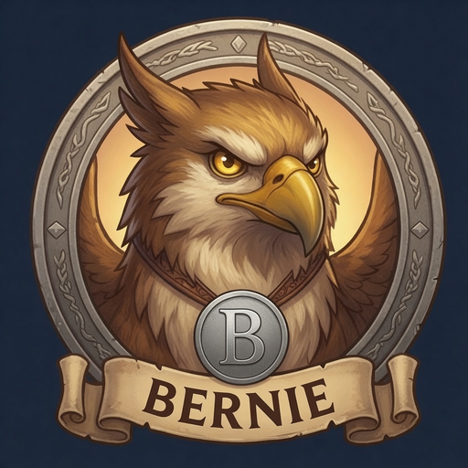

<p align="center">
  
</p>

<h1 align="center">Bernie</h1>

<p align="center">
  <strong>The family coordination bot — built for households, not solo chat.</strong><br>
  Discord-native. Home Assistant-native. Quiet until it matters.
</p>

<p align="center">
  <a href="LICENSE"></a>
  
  
  
  
</p>

---

Most AI assistants are built for **one person** — a terminal, a DM, a personal workspace. Bernie is built for **one household**: shared Discord channels, per-person roles (parents vs kids), a morning summary everyone sees, and chores someone actually has to approve.

He is not a generic ChatGPT wrapper. He is **family by design**.

**Home Assistant is the spine.** Bernie talks to your HA instance first — presence, lights, sensors, zones, person entities — and from there unlocks the rest of your homelab without wiring up a dozen one-off integrations: Frigate cameras, UniFi clients, vehicle trackers, sleep sensors, network hosts, and anything else you've already modeled in HA. One config block, one token, natural language in `#smithy`.

---

## Features

- **Home Assistant native** — presence, lights, switches, climate, media, and zones via your HA map; Discord + web **Home** tab + HTTP API share the same tools
- **Family-first Discord** — shared channels, parent/kid roles, chore approval, quiet hours
- **OpenAI-compatible API + Swagger** — other apps talk to Bernie; **he keeps the keys**. Interactive docs at `:8000/docs`. See [API](#api-connect-your-agent)
- **Daily morning summary** — calendar, weather, who's home — on a schedule
- **Google Calendar** — week view, school, homework, RSVPs with your OAuth
- **Reminders & automations** — per-person DMs or channel pings
- **Meal planning** — dedicated channel for meals, groceries, recipes
- **Task board** — family chores + agent jobs; kids complete, parents approve; web dashboard included
- **Presence & location** — who is home / where is someone, from HA trackers
- **Cameras** — Frigate snapshots and person alerts (optional)
- **Transit & local services** — live buses and garbage day where you configure a feed
- **Weather** — live forecast for your coordinates
- **Background helpers** — nightly notes, study guides, research (optional local Ollama)
- **Homelab tools** — health, network status, optional Langfuse
- **Local & audited** — SQLite on disk, secrets gitignored, tool gateway with permissions

Full catalog: [**Tools**](docs/user-guide/tools.md) · [**Slash commands**](docs/user-guide/slash-commands.md) · [**What you can ask**](docs/user-guide/what-you-can-ask.md)

### What's in the repo (for beginners)

| Path | What it is |
|------|------------|
| **`bot/`** | The application — Discord, API, workers (what Docker runs) |
| **`web/`** | Family dashboard UI |
| **`scripts/`** | One-off helpers (Google login, tests). **Not** the main app — see [scripts/README.md](scripts/README.md) |
| **`docs/`** | Guides (also buildable as a small website — see below) |
| **`config.minimal.example.json`** | Copy to `config.json` for first run |

Mascot image: [docs/assets/ATTRIBUTION.md](docs/assets/ATTRIBUTION.md).

---

## Why household-first

| Design choice | What it means in practice |
|---|---|
| **Household, not user** | Roles for parents and kids, shared channels, per-person prefs — not a single workspace tied to one identity |
| **Home Assistant as the spine** | Presence, zones, and devices come first; cameras, transit, and sensors plug in through HA instead of one-off integrations |
| **Bernie holds the keys** | Your LLM provider (Anthropic, OpenAI, OpenRouter, Grok, Ollama, …), HA, and Google credentials live in one place; clients get a single bearer token over an OpenAI-compatible API |
| **Proactive by default** | Morning summaries and reminders run on a schedule — nobody has to open an app and ask |
| **Built for the homelab** | Docker, LAN-first, SQLite on disk — runs where your other self-hosted services already live |

Bernie doesn't try to be your coding copilot or your second brain. He tries to be the **calm adult in the family channel** who already checked the calendar, knows who's home, and won't ping the whole house unless it matters.

---

## At a glance

| | |
|---|---|
| **Talk to him** | Discord (`#smithy` + channel layout) · web dashboard `:8000` · **OpenAI-compatible API** (`/v1/chat/completions`) · **Swagger** (`/docs`) |
| **Brain** | Your pick — Claude, GPT, Grok, OpenRouter models, local Ollama, … (chat + tools); local Ollama also for overnight workers |
| **Schedule** | Google Calendar — your OAuth app, your tokens |
| **Home** | Home Assistant → Frigate, UniFi, sensors, vehicles, sleep |
| **Data** | SQLite on your host; `.env` + `credentials/` never in git |

---

## API — connect your agent

Bernie exposes an **OpenAI-compatible** chat API on the same port as the dashboard (`:8000`). Use it to plug in OpenWebUI, scripts, or any client that speaks `POST /v1/chat/completions` — without scattering LLM, HA, or Google credentials across every app.

**He keeps the keys.** Your model provider (Anthropic, OpenAI, OpenRouter, xAI/Grok, Ollama, LiteLLM, …) plus HA and Google live in Bernie's `.env` / `config.json`. Callers only need:

- Base URL: `http://<host>:8000` (LAN or VPN; treat like admin access)
- Bearer token: `BERNIE_API_TOKEN` (same master token the dashboard API uses)
- Model id: `bernie`

| Endpoint | Auth | Purpose |
|----------|------|---------|
| `GET /v1/models` | `Authorization: Bearer <token>` | Lists model `bernie` |
| `POST /v1/chat/completions` | Bearer | Chat with full Bernie tools (HA, calendar, tasks, …) and family RBAC |
| `POST /api/chat` | `X-Bernie-Token` | Dashboard-style chat + optional threads |
| **Swagger UI** | browser on LAN | Interactive OpenAPI docs for the full REST surface |
| OpenAPI JSON | — | Machine-readable schema |

**Browse the API:** open `http://<host>:8000/docs` (Swagger UI) or `/redoc` after the API container is up. Schema is also at `/openapi.json`. Most routes still need a dashboard login token or `BERNIE_API_TOKEN` when you try them from Swagger.

Replies go through the same tool gateway and person/role map as Discord — not a stripped “text only” shim.

### Minimal example

```bash
export BERNIE_URL=http://192.168.1.X:8000   # your API host
export BERNIE_API_TOKEN=…                    # from .env

curl -sS "$BERNIE_URL/v1/chat/completions" \
  -H "Authorization: Bearer $BERNIE_API_TOKEN" \
  -H "Content-Type: application/json" \
  -d '{
    "model": "bernie",
    "messages": [{"role": "user", "content": "Who is home right now?"}],
    "stream": false
  }'
```

### OpenWebUI (or similar)

1. Add a connection / provider with base URL `http://<bernie-host>:8000/v1` (or whatever path your client expects for OpenAI-compat).
2. API key = `BERNIE_API_TOKEN`.
3. Model = `bernie`.
4. Optional: map OpenWebUI users → family members with `openwebui_users` / `webui_user` in `config.json` so RBAC and memory attach to the right person.

More context: [optional services](docs/integrations/optional-services.md) · [deploy / CORS](docs/deploy.md).

> **Exposure:** keep `:8000` on LAN or VPN. Public internet needs TLS + strong auth — the bearer token is powerful (same class of access as the dashboard).

---

## Quick start

**You need:** Docker Compose, a Discord server, an LLM API key for **your** preferred provider (Anthropic, OpenAI, OpenRouter, xAI/Grok, … — or local Ollama), ~20 minutes.

### 1 · Clone & configure

```bash
git clone https://github.com/DonnieFi/bernie.git family-bot
cd family-bot

cp .env.example .env
cp config.minimal.example.json config.json
$EDITOR .env          # DISCORD_TOKEN, INTERNAL_POST_SECRET, + your LLM key(s)
$EDITOR config.json   # Discord snowflakes, timezone, family, active_model
```

Generate a shared secret for the three-container stack:

```bash
openssl rand -hex 32   # paste into INTERNAL_POST_SECRET in .env
```

### 2 · Discord

Follow **[docs/discord-onboarding.md](docs/discord-onboarding.md)** — bot token, intents, invite URL, channel IDs.

### 3 · Google Calendar (recommended)

Each household uses **their own** Google Cloud OAuth client:

```bash
pip install --user google-auth-oauthlib google-api-python-client
python scripts/auth_google.py    # → credentials/token.json
```

Step-by-step: **[docs/google-oauth.md](docs/google-oauth.md)**

### 4 · Home Assistant (when you're ready)

Add your HA URL + long-lived token to `config.json` → `home_assistant`. Bernie immediately gains presence, device control, and zone landmarks for transit — no separate integration per device.

See [Layer by layer § HA](docs/getting-started/layer-by-layer.md#layer-3-home-assistant).

### 5 · Run

```bash
docker compose -f docker-compose.public.yml up -d --build
docker compose -f docker-compose.public.yml logs -f bernie-discord
```

Say hello in your main channel. Bernie should answer.

> Homelab deploys: `docker compose up` — see [docs/deploy.md](docs/deploy.md).

---

## System requirements

| Resource | Typical |
|----------|---------|
| RAM | ~165 MB idle; ~400 MB during tool-heavy turns |
| Disk | ~10 MB SQLite + Docker image |
| CPU | Modest x86_64 or arm64 |
| GPU | Not required; nice if Ollama runs on the same box |

**Ports:** `:8000` web dashboard + OpenAI-compatible API (`/v1/*`, `/api/*`). Outbound: your LLM provider(s) + Google + your LAN (HA, Frigate, LiteLLM, …).

---

## Documentation

**Start here:** [docs/README.md](docs/README.md)

| Guide | What it covers |
|-------|----------------|
| [**Quickstart**](docs/getting-started/quickstart.md) | First Discord reply in ~30–45 min |
| [**Layer by layer**](docs/getting-started/layer-by-layer.md) | Calendar → HA → cameras → email |
| [**Discord setup**](docs/discord-onboarding.md) | Bot token, intents, channel IDs |
| [**Google OAuth**](docs/google-oauth.md) | Calendar + optional Gmail |
| [**What you can ask**](docs/user-guide/what-you-can-ask.md) | Natural-language examples |
| [**Tools**](docs/user-guide/tools.md) | Full tool catalog |
| [**FAQ**](docs/help/faq.md) · [**Troubleshooting**](docs/help/troubleshooting.md) | When something breaks |
| [**Optional integrations**](docs/integrations/optional-services.md) | OpenWebUI, Frigate, Ollama, … |
| [**API**](#api-connect-your-agent) | OpenAI-compatible `/v1` + Swagger at `/docs` |

### Optional: browse docs as a website

Markdown in `docs/` can be built with [MkDocs](https://www.mkdocs.org/) (beginner-friendly, Python):

```bash
pip install -r requirements-docs.txt
mkdocs serve    # http://127.0.0.1:8001
```

GitHub Pages workflow (`.github/workflows/docs.yml`) can publish that site when you enable Pages on the repo.

**Broken?** → [Troubleshooting](docs/help/troubleshooting.md)

---

## Discord channels

| Channel | Purpose |
|---------|---------|
| `#smithy` | Main family channel — summaries, chat, presence |
| `#anvil` | Admin — `/model`, `/reload`, eval |
| `#furnace` | Meal planning |
| `#slag` | Extended AI chat |
| `#security` | Frigate / camera alerts |
| `#bellows` | Chit-chat — bot silent (optional) |

---

## Data & privacy

| Data | Stays where |
|------|-------------|
| Chat text | Discord + your configured LLM provider per turn |
| Calendar | Google (your account) |
| HA / cameras / presence | **LAN** — read into prompts, not uploaded |
| History & routines | Local SQLite |
| Secrets | `.env` + `credentials/` — gitignored |

No telemetry beacons. Langfuse is opt-in and self-hosted.

---

## Running cost (ballpark)

Depends on model and chatter volume. Example: family of four on a mid-tier cloud chat model often lands around **~$25–30/month**; local Ollama for background workers is **$0** API. Quiet days: pennies. Switch models anytime (`/model`, Settings) — Bernie is not locked to one vendor.

---

## License

[MIT](LICENSE) © 2026 DonnieFi

Copyright and contact are in [`LICENSE`](LICENSE) — use **GitHub issues** (or private vulnerability reporting in [`SECURITY.md`](SECURITY.md)); no maintainer email is published in the tree.

[SECURITY.md](SECURITY.md) · [CONTRIBUTING.md](CONTRIBUTING.md)
